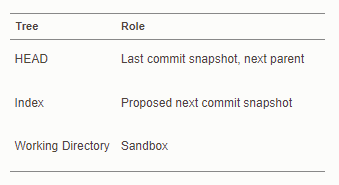
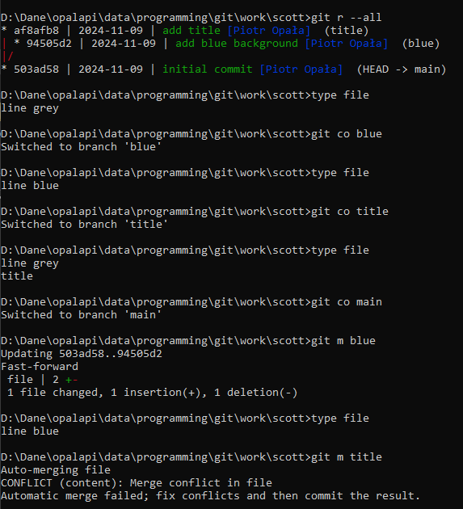

# Important

Notes for `git version 2.47.1`.

# Lifecycle of the status of repo files

# Setup and Config

## Configuration

- listing:

        git config list
        git config list --show-origin

- important config `TODO`:

    - identification:

            git config set --global user.name "Piotr Opała"
            git config set --global user.email opalapj@gmail.com

    - default branch name:

            git config set --global init.defaultBranch main

    - editor:

        - Linux users:

                git config set --global core.editor "vim --nofork"
        
        - Windows users:
        
                git config set --global core.editor notepad

    - EOL:

            git config set --global core.safecrlf true

        - Unix/Mac users:

                git config set --global core.autocrlf input

        - Windows users:

                git config set --global core.autocrlf true
    
    - aliases:

            git config set --global alias.lb "branch --all -vv"

        > See chapter: [aliases](#aliases)

    - upstream autosetup for push:

            git config set --global push.autoSetupRemote true

## Authenticate `gh` and `git` with `GitHub`

    gh auth setup-git

or

    gh auth login

https://docs.github.com/en/get-started/git-basics/set-up-git#authenticating-with-github-from-git

## Help

    git <command> -h
    git <command> --help
    git help <command>

# Getting and Creating Projects

## Getting

- with cloned repo name as target repo name

        git clone <cloned-repo-name>

- with custom target repo name

        git clone <cloned-repo-name> <target-repo-name>

- create a bare repository to publish your changes to the public:

        git clone --bare <cloned-repo-name> <target-repo-name>

> `git clone` command implicitly adds the `origin` remote for you.

> `git clone` command automatically sets up your local `main` branch to track
> the remote `main` branch.

## Creating

- within existing project's directory:

        git init

- within project's parent directory:

        git init <repo-name>

- create a bare repository:

        git init --bare
        git init --bare <repo-name>

# Basic Snapshotting

## Ignored and untracked files

[`.gitignore`][1] files for different languages.

I assume that the best practice to do not keep untracked files. All files
should be divided into:
- `tracked` - under version control
- `ignored` - specified in `.gitignore`

### `.gitignore`

More about [`.gitignore`][2] file, e.g. difference between `*.py` and `/*.py`

### Stop tracking the file but keep it in local project directory

1. Remove the file from tracking (but not from disk):

        git rm --cached dir/file.csv

2. Add it to `.gitignore` to prevent future tracking.

3. Commit the changes:

        git commit -m "Stop tracking dir/file.csv and add to .gitignore"

## Adding files to repo

`git add` is a multipurpose command - you use it to begin tracking new files,
to stage files, and to do other things like marking merge-conflicted files as
resolved. It may be helpful to think of it more as “add precisely this content
to the next commit” rather than “add this file to the project”.

    git add <pathspec>
    git add .

## Show changes

- show the working tree status:

        git status
        git status --short

- show changes between commits, commit and working tree, etc:

        git diff
        git diff --staged

## Commiting

- record changes to the repository:

        git commit

- with `<msg>` as the commit message:

        git commit -m <msg>

- by using the `-a` switch with the commit command to automatically "add"
changes from all known files (i.e. all files that are already listed in the
index):

        git commit -a

> The `--dry-run` option can be used to obtain a summary of what is included by
> any of the above for the next commit by giving the same set of parameters
> (options and paths).

> If you make a commit and then find a mistake immediately after that, you can
> recover from it with `git reset`.

## Commit history

- show commit logs:

        git log <branch>
        git log <commit>
        git log <tagname>

- limit the number of commits to output:

        git log -<number>

- useful formatters:

        git log -<number> --patch
        git log -<number> --stat
        git log -<number> --pretty=[oneline | short | medium | full | ...]
       
- show all branches:

       git log -all

> Custom logs in `.gitconfig` file.

## Removing files

- removing from tracked files and working directory **with** staging:

        git rm <pathspec>
    
    > 1. File **is** removed from working directory.
    > 2. File **is** staged for commit.

- removing from tracked files and working directory **without** staging:

        del <pathspec>

    > 1. File **is** removed from working directory.
    > 2. File **is not** staged for commit.

- removing from tracked files but not from working directory **with** staging:

        git rm --cached <pathspec>
    
    > 1. File **is** removed from working directory.
    > 2. File **is** staged for commit.

## Moving/renaming files 

Move or rename a file, a directory, or a symlink:

    git mv <source>​ <destination>

One command:

    git mv README.md README

instead of three:

    mv README.md README
    git rm README.md
    git add README

## Undoing things

- when you commit too early and possibly forget to add some files, or you
  mess up your commit message:

        git commit --amend
    
    e.g.:

        git commit -m 'Initial commit'
        git add forgotten_file
        git commit --amend

- the same as above, without editing commit message:

        git commit --amend --no-edit

- to unstage:

        git restore --staged <pathspec>

- to discard changes in working directory:

        git restore <pathspec>

## Rewriting history

    git rebase -i HEAD~<number-of-last-commits-to-edit>

## Revert, restore, reset

### `revert`

`git-revert` is about making a new commit that reverts the changes made by other
commit(s).

    git revert <commit>

### `restore`

`git-restore` is about restoring files in the working tree from either the index
or another commit. This command does not update your branch. The command can also
be used to restore files in the index from another commit.

### `reset`

`git-reset` is about updating your branch, moving the tip in order to add or
remove commits from the branch. This operation changes the commit history.
Resets the index but not the working tree (i.e., the changed files are preserved
but not marked for commit) and reports what has not been updated. This is the
default action.

> `git reset HEAD~` resets to the parent of HEAD

- `git reset --mixed HEAD~` resets the HEAD and index but not the working tree
(default mode):

- `git reset --soft HEAD~` resets the HEAD but not the index:

- `git reset --hard HEAD~` resets the HEAD, index and working directory:

# Branching and Merging

A `branch` in Git is simply a lightweight movable pointer to one of 
`commits`. The default `branch` name in Git is `main`. As you start making
`commits`, you're given a `main` `branch` that points to the last `commit` you
made. Every time you `commit`, the `main` `branch` pointer moves forward
automatically.

## Branching

- listing:

        git branch
        git branch -vv
        git branch --all
        git branch --merged
        git branch --no-merged

- switching branches:

        git switch <branch-name>

- creating branch at current point:

        git branch <branch-name>

- creating branch at specified start point without switching:

        git branch <branch-name> <start-point>

- creating branch at specified start point with switching:

        git switch -c <branch-name> <start-point>

- deleting branches:

        git branch -d <branch-name>
        git branch -d --remotes <remote-alias>/<branch-name>

- deleting remote branches:

        git push <remote-alias> -d <branch>

- moving/renaming branch:

        git branch --move <current-name> <new-name>

- setting upstream for current local branch:

        git branch -u <remote-alias>/<branch>

- setting upstream for specified local branch:

        git branch -u <remote-alias>/<branch> <local-branch>

## Merging

    git merge <branch>
    git merge --no-ff <branch>

## Rebasing

    git rebase <branch1> [<branch2>...]

## Rebase vs. Merge

You can get the best of both worlds:

- **rebase** local changes before pushing to clean up your work

- **never rebase** anything that you’ve pushed somewhere.

# Tagging

- listing tags:

        git tag
        git tag --list <pattern>
        git tag --list "v1.8.5*"

- creating tag:
  
  - lightweight tags:

        git tag <tagname>

  - annotated tags:

        git tag -a <tagname> -m <msg>

- show info about tag:

        git show <tagname>

- tagging specified point:

        git tag <tagname> [<commit> | <object>]

- deleting tag:

        git tag -d <tagname>

# Working with remotes

`remote` - a repository that is elsewhere.

`bare repository` - a repository that has no working directory.

`origin` - default name Git gives to the server you cloned from
(`clone.defaultRemoteName`).

`remote-tracking branch` - reference to the state of remote branche; name takes
the form `<remote>`/`<branch>` e.g. `origin`/`main`

`tracking branch` - local branches that have a direct relationship to a remote
branch. If you're on a `tracking branch` and type `git pull`, Git automatically
knows which server to fetch from and which branch to merge in.

`upstream branch` - remote branch that is tracked by `tracking branch`.

A `remote` repository is generally a `bare` repository - a Git repository that has
no working directory. Because the repository is only used as a collaboration
point, there is no reason to have a snapshot checked out on disk; it's just the
Git data. In the simplest terms, a `bare` repository is the contents of your
project's `.git` directory and nothing else.

## Listing the remotes

Lists the aliases of each remote handle you've specified.

    git remote
    git remote -v

> If you've cloned your repository, you should at least see `origin`.

## Inspecting a remote

Gives some information about the remote.

    git remote show <remote-alias>

## Adding a remote

Adds the bare repository as a remote to our repository.

    git remote add <remote-alias> <url>

> `git remote add` command explicitly adds new remote for you.

## Renaming a remote

Change a remote's alias:

    git remote rename <old-remote-alias> <new-remote-alias>

## Removing a remote

Remove a remote:

    git remote remove <remote-alias>

## Fetching from a remote

Synchronize work with a given `remote`, updates `remote-tracking branches`.

When no remote is specified, by default the `origin` remote will be used, unless
there's an `upstream branch` configured for the current branch.

    git fetch <remote-alias>
    git fetch
    git fetch --all

## Pulling from a remote

Automatically fetch and then `merge`/`rebase` that remote branch into your
current branch.

Generally it's better to simply use the `fetch` and `merge`/`rebase` commands
explicitly as the magic of git `pull` can often be confusing.

## Pushing to a remote

    git push <remote-alias> <local-branch>
    git push -u <remote-alias> <local-branch>
    git push <remote-alias> <local-branch>:<remote-branch>
    git push

If you want to push your `main` branch to your `origin` server (again, cloning
generally sets up both of those names for you automatically), then you can run
this to push any commits you've done back up to the server:

    git push origin main

If you want to push your `featureB` branch to your `origin`'s `featureBee` branch:

    git push origin featureB:featureBee

If you want to set upstream:

    git push -u origin featureB

> This command works only if you cloned from a server to which you have write
> access and if nobody has pushed in the meantime. If you and someone else clone
> at the same time and they push upstream and then you push upstream, your push
> will rightly be rejected. You'll have to fetch their work first and incorporate
> it into yours before you'll be allowed to push.

> Use `-f/--force` option to force operations like push amended commit or take
> remote branch `n` commits back.

By default, the git push command doesn’t transfer tags to remote servers. You
will have to explicitly push tags to a shared server after you have created
them. This process is just like sharing remote branches — you can run:

    git push origin <tagname>
    git push origin v1

## Pruning a remote

If you want to delete local references to branches on remotes that have
themeselves deleted those branches:

    git remote prune --dry-run <remote-alias>
    git remote prune <remote-alias>

# Adding local repo to `GitHub`

## Using `GitHub CLI`

https://docs.github.com/en/migrations/importing-source-code/using-the-command-line-to-import-source-code/adding-locally-hosted-code-to-github#adding-a-local-repository-to-github-with-github-cli

- create `GitHub` repo and follow interactive prompts:

        gh repo create

## Using `git`

https://docs.github.com/en/migrations/importing-source-code/using-the-command-line-to-import-source-code/adding-locally-hosted-code-to-github#adding-a-local-repository-to-github-using-git

- create `GitHub` repo using web app
- add `GitHub` repo to remotes:

        git remote add origin <repo-url>

- switch to `main` branch:

        git switch main

 - push `main` branch to `GitHub` repo and set upstream:
 
        git push -u origin main

# Adding local repo to server (generally)

- create bare repo on the server:

        user@server:path\to\bare_repos_dir> git init --bare my_repo.git

- add my_repo.git to remotes:

        git remote add origin user@server:path\to\bare_repos_dir\my_repo.git

- switch to `main` branch:

        git switch main

 - push `main` branch to my_repo.git and set upstream:
 
        git push -u origin main

# Contributing to a project

`push access` - read and write access to the project and Git repository.

## [Integration-Manager Workflow][3]

- This scenario often includes a `blessed repository` that represents the
"official" project where:

    - a `integration manager` has write access,

    - each `developer` has read access.

- A `developer` forks `blessed repository` creating own `public` copy with
write access.

- A `developer` clones:
    - own `public` copy...
        
        or

    - `blessed repository`...
    
    ...locally creating own `private` copy.
    
- A `developer` creates a descriptive `topic branch` and makes `commits`.

- A `developer` pushes to their own `public` copy.

- A `developer` sends the `integration manager`:

    - message generated by `git request-pull` via email...
    
        or
    
    - `pull request` via GitHub...
    
    ...asking them to pull changes.

- The `integration manager` adds the `developer`’s repository as a remote and
merges locally.

- The `integration manager` pushes merged changes to the `blessed repository`.

# Pull request

    git request-pull [-p] <start> <URL> [<end>] 

# Inspection

- ancestry references - place a `^` or `~` at the end of a reference, Git
resolves it to mean the parent of that commit:

        git show HEAD^
        git show HEAD~

- commit ranges - asks Git to resolve a range of commits that are reachable from
`commit2` but aren’t reachable from `commit1`:

        git log commit1..commit2
        git log commit2 ^commit1

- update files in the working tree to match the specified point:

        git checkout <branch>
        git checkout <commit>
        git checkout <tagname>

- show information about files in the index and the working tree:

        git ls-files

- list references in a remote repository:

        git ls-remote

- manage reflog information; very helpful, e.g. for reseting to non-tagged commit:

        git reflog

# Aliases

See config file: https://github.com/opalapj/vcs/blob/main/.gitconfig

# Hooks

- bypass pre-commit and commit-msg hooks:

        git commit --no-verify
        git commit -n

## `pre-commit`

https://pre-commit.com/

# Examples

## `git`

https://git-scm.com/book/en/v2/Distributed-Git-Contributing-to-a-Project

## `GitHub`

https://git-scm.com/book/en/v2/GitHub-Contributing-to-a-Project

# GUIs

- [GitHub Desktop](https://desktop.github.com/download/)
- `gitk` (preinstalled with git)
- `git-gui` (preinstalled with git)

# Misc.

## Empty directories

- place empty `.gitkeep` file in given directory
- place `README` with quick note in given directory

## Difference in marging files with small content

# Resources 

https://git-scm.com/book/en/v2

https://git-scm.com/docs

https://gitimmersion.com/

[1]: https://github.com/github/gitignore

[2]: https://git-scm.com/docs/gitignore

[3]: https://git-scm.com/book/en/v2/Distributed-Git-Distributed-Workflows#wfdiag_b
